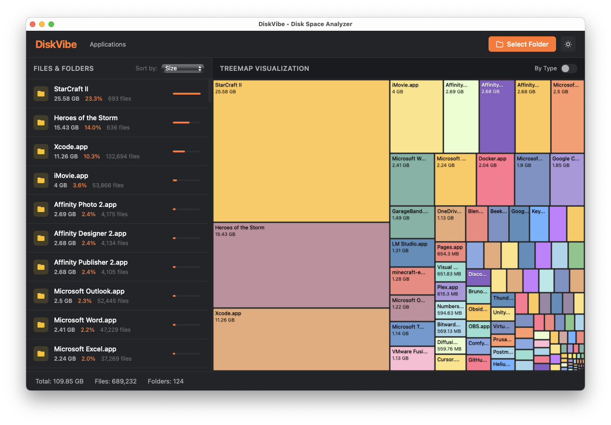

# DiskVibe

A fast, visual disk space analyzer for macOS and Linux.



## Features

- Parallel directory scanning using jwalk
- Treemap visualization of disk usage
- Color-coded by file type (folders, media, apps, system files)
- Drill-down navigation into folders
- Sortable file list by size, name, or file count
- Dark/light mode toggle

## Download

Grab the latest release from the [Releases page](https://github.com/yourusername/diskvibe/releases):

- **macOS**: `.dmg` (Apple Silicon & Intel)
- **Linux**: `.AppImage`, `.deb`
- **Windows**: `.msi`, `.exe`

> **Note**: The app is unsigned. On macOS, right-click the app and select "Open" on first launch. On Windows, click "More info" then "Run anyway" on the SmartScreen prompt.

## Building from Source

```bash
# Install dependencies
pnpm install

# Run in development mode
pnpm tauri dev

# Build for production
pnpm tauri build
```

## Tech Stack

- [Tauri 2](https://tauri.app/) - Desktop app framework
- [Rust](https://www.rust-lang.org/) + [jwalk](https://crates.io/crates/jwalk) - Parallel filesystem scanning
- [D3.js](https://d3js.org/) - Treemap visualization
- Vanilla JS/HTML/CSS - Frontend

## License

MIT License

Copyright (c) 2025

Permission is hereby granted, free of charge, to any person obtaining a copy
of this software and associated documentation files (the "Software"), to deal
in the Software without restriction, including without limitation the rights
to use, copy, modify, merge, publish, distribute, sublicense, and/or sell
copies of the Software, and to permit persons to whom the Software is
furnished to do so, subject to the following conditions:

The above copyright notice and this permission notice shall be included in all
copies or substantial portions of the Software.

THE SOFTWARE IS PROVIDED "AS IS", WITHOUT WARRANTY OF ANY KIND, EXPRESS OR
IMPLIED, INCLUDING BUT NOT LIMITED TO THE WARRANTIES OF MERCHANTABILITY,
FITNESS FOR A PARTICULAR PURPOSE AND NONINFRINGEMENT. IN NO EVENT SHALL THE
AUTHORS OR COPYRIGHT HOLDERS BE LIABLE FOR ANY CLAIM, DAMAGES OR OTHER
LIABILITY, WHETHER IN AN ACTION OF CONTRACT, TORT OR OTHERWISE, ARISING FROM,
OUT OF OR IN CONNECTION WITH THE SOFTWARE OR THE USE OR OTHER DEALINGS IN THE
SOFTWARE.
