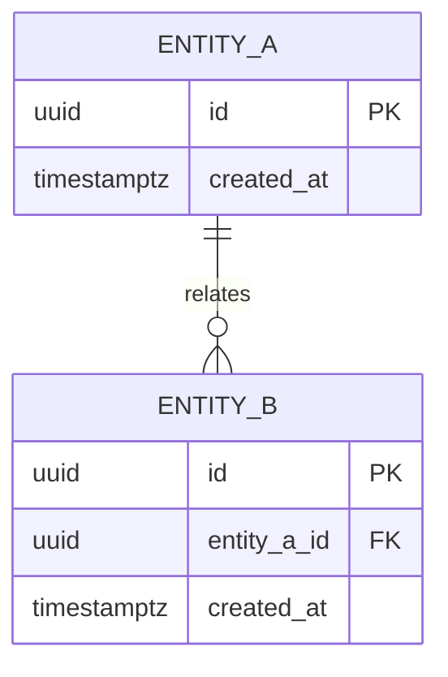
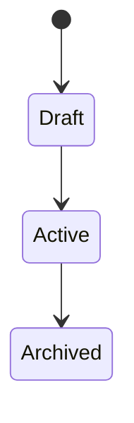

# State: {{Feature Name}}

## ERD

## Entities

| Entity | Stable ID | Purpose | Owner | Lifecycle |
|---|---|---|---|---|
| TBD | `entity.tbd` | TBD | TBD | TBD |

## Invariants

| ID | Rule | Enforcement |
|---|---|---|
| `inv.tbd` | TBD | TBD |

## Derived State

| Name | Definition | Source entities |
|---|---|---|
| TBD | TBD | TBD |

## Lifecycle

## Retention and Audit

TBD

## Tenancy and Ownership

TBD
