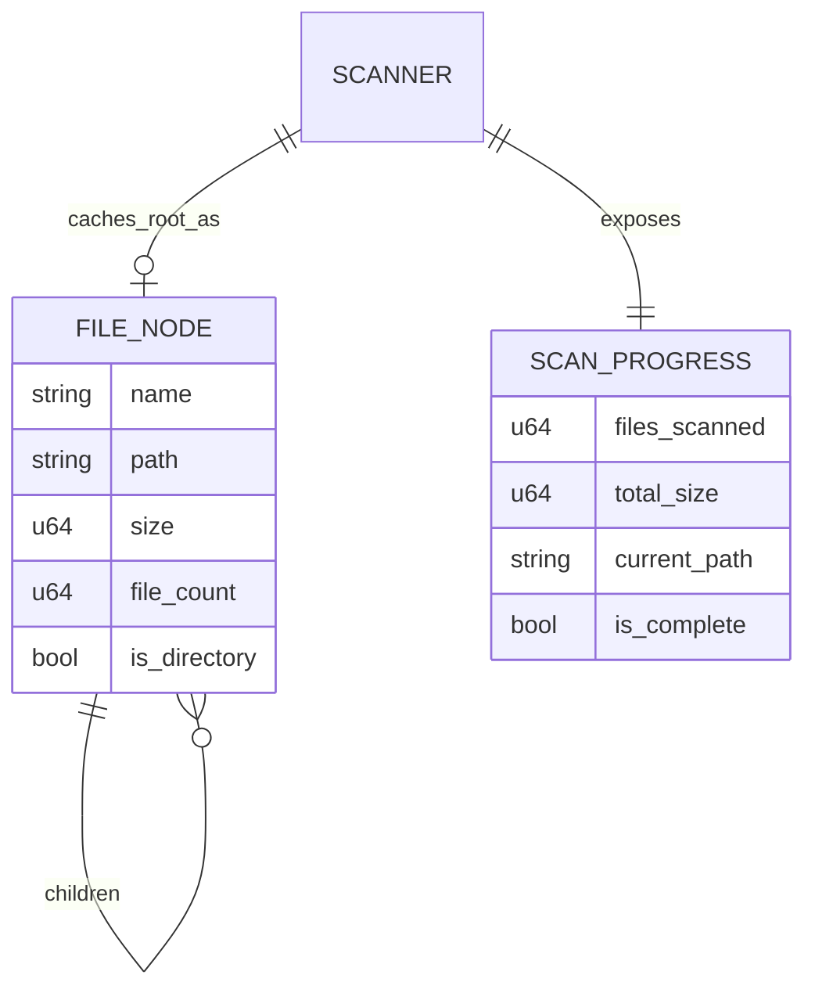

# Bootstrap State

Session-scoped filesystem tree and scan progress. No application database.

## Entities

### `entity.file-node` (`FileNode`)

| Field | Type | Notes |
|---|---|---|
| `name` | string | File or directory name |
| `path` | string | Absolute path string |
| `size` | u64 | For files: Unix allocated blocks×512; non-Unix logical length. For dirs: sum of children |
| `file_count` | u64 | 1 for files; rolled-up count for directories |
| `is_directory` | bool | |
| `children` | `FileNode[]` optional | Present for directories; omitted/null for files when serialized |

### `entity.scan-progress` (`ScanProgress`)

| Field | Type | Notes |
|---|---|---|
| `files_scanned` | u64 | Entries processed so far |
| `total_size` | u64 | Accumulated file size during scan |
| `current_path` | string | Throttled path sample for UI |
| `is_complete` | bool | Backend `get_progress` currently always false mid-poll; UI uses scan completion |
| `error` | string optional | Reserved; progress poll does not currently surface scan errors here |

### Session components (`AppState`)

| Field | Type | Notes |
|---|---|---|
| `scanner` | `Scanner` | Cancel flag + progress atomics |
| `cached_tree` | `Option<FileNode>` | Last successful full `scan_directory` result, kept in sync by `rescan_item` patches |

## Relationships



## Invariants

| ID | Rule |
|---|---|
| `inv.scan-root-exists` | Full scan requires root path to exist before walk |
| `inv.no-symlink-follow` | Walk does not follow symlinks (`follow_links(false)`) |
| `inv.dir-size-rollup` | Directory `size` is sum of child node sizes after tree build |
| `inv.dir-count-rollup` | Directory `file_count` is sum of descendant file counts |
| `inv.children-sorted-by-size` | Children sorted size descending after build/rescan |
| `inv.session-cache-scope` | Tree and progress are process memory only |
| `inv.unix-allocated-size` | On Unix, file size is `st_blocks * 512`, not necessarily logical length |

## Lifecycle

```text
App start
  -> no tree / empty cache
  -> user selects path
  -> scan running (progress updates, cancel possible)
  -> scan complete (tree + cache) OR cancelled/error
  -> user navigates / sorts / rescan item / reveal
  -> process exit: all state discarded
```

## Derived / UI-only state

Not durable product state; lives in `main.js`:

- `currentNode`, `navigationStack`, `treeStates` (expand/scroll per root)
- Sort mode, color-by-type, dark mode theme
